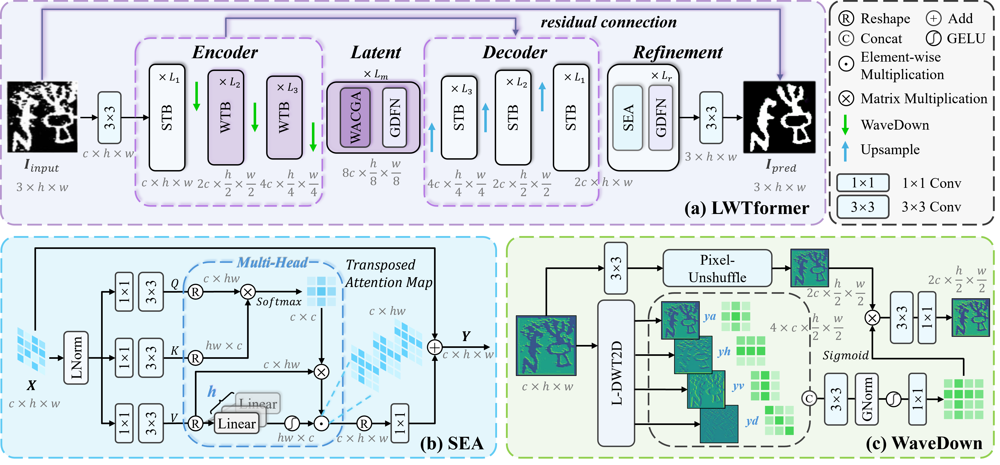
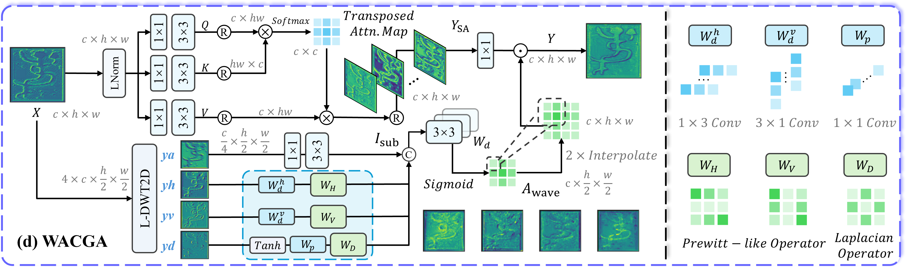
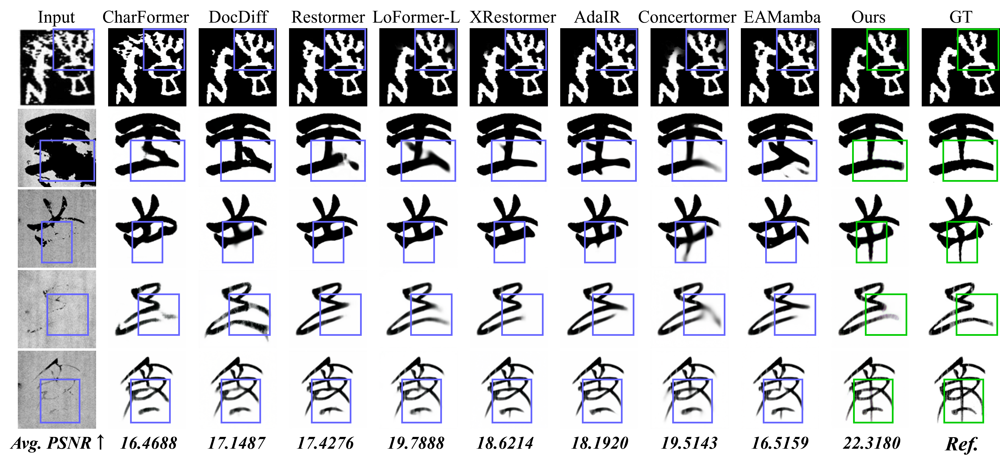
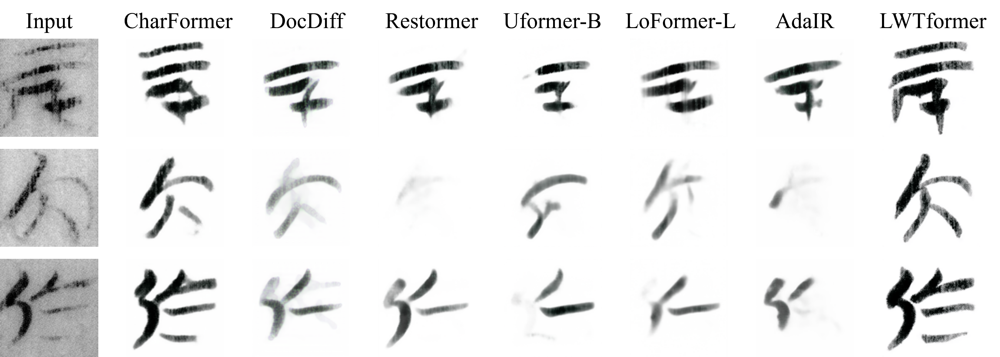

# LWTformer: A Detail-Aware, Learnable Wavelet-Transformer for Ancient  Chinese Character Image Restoration

<div align="center">

**The official PyTorch implementation of the paper:**
<br>
**"LWTformer: A Detail-Aware, Learnable Wavelet-Transformer for Ancient Chinese Character Image Restoration"**

</div>


## 📖 Abstract

<details>
<summary>CLICK to view the full Abstract</summary>

> Ancient Chinese characters hold profound cultural and scholarly value, yet their images often suffer from erosion, abrasion, fractures, and noise due to aging, resulting in blurred strokes and missing edges. While deep learning-based image restoration has advanced significantly, the complex structures and unique configurations of ancient characters present distinct challenges. Specifically, the deep entanglement between noise and fine strokes makes it challenging to strike a balance between denoising and preserving subtle stroke details. Precisely separating these components remains a critical challenge, as conventional methods struggle to disentangle them effectively. 
>
> To address these issues, we propose LWTformer, a novel architecture integrating learnable 2D Discrete Wavelet Transform (2D-DWT) for ancient character image restoration. Our key contribution lies in a learnable wavelet downsampling module (WaveDown), which precisely separates ancient character images into low-frequency approximate components that preserve overall character structures and high-frequency detail components that capture distinctive stroke features. Additionally, we introduce Spatial-Enhanced Attention (SEA) and Wavelet-Aware Convolutional Gated Attention (WACGA) to better capture fine strokes and damaged edges. Experiments on Oracle Bone Inscriptions and Warring States Bamboo Slips datasets show that LWTformer outperforms state-of-the-art methods both qualitatively and quantitatively, providing a technical approach more aligned with the glyph structures for ancient Chinese character image restoration.
</details>

<div align="center">
  
  <br> 
  <p align="center" style="color: gray;"><b>Figure 1: The overall architecture of LWTformer and the details of the proposed modules.</b></p>
</div>


## 📅 News
- **2025.11.29**: We have made all our code publicly available.
- **2025.11.29**: Our paper is _under review_.

## 🚧 TODO List
- [x] Release the complete code.
- [ ] Add WebUI demo.
- [ ] Add the pre-training of module.
- [ ] Build a larger ancient Chinese Character dataset & improve the degradation algorithm.

## 🛠️ Installation
### Prerequisites (Recommended)
- Linux
- Python 3.8
- Pytorch 2.4.1
- CUDA 12.1

### Environment Setup
We recommend using Conda to manage your environment:
```bash
conda create -n LWTformer_env python=3.8 -y
conda activate LWTformer_env

# Install PyTorch
pip install torch==2.4.1+cu121 torchvision==0.19.1+cu121 torchaudio==2.4.1+cu121 -f https://download.pytorch.org/whl/torch_stable.html

# Install other dependencies
pip install -r requirements.txt
```
Verify the installation:
```bash
python test_env.py
```

## 🏋️ Training
### 📂 Data Construction
Please organize your training data as follows:
```Plaintext
├── Oracle                               
│   ├── train
│   │   ├── input
│   │   │       ├── 0001_6.png
│   │   │       └── ...
│   │   └── target
│   │           ├── 0001_6.png
│   │           └── ...
│   └── test
│       ├── input
│       │       ├── 0002_1.png
│       │       └── ...
│       └── target
│               ├── 0002_1.png
│               └── ...
```
### ⚙️ Training Configuration
Modify the parameters in `options/train_LWTformer_options.py` to match your setup. Key parameters include:

| Parameter | Description | Example Value |
| :--- | :--- | :--- |
| `--nepoch` | Total number of training epochs | `500` (Oracle), `200` (WSC41K) |
| `--dataset` | Dataset name (used for logging) | `Oracle` |
| `--task` | Task name (used for logging) | `Restoration` |
| `--dim` | Feature dimension size | `32` (LWTformer-S), `48` (LWTformer-L) |
| `--arch` | Model architecture | `LWTformer-S`, `LWTformer-L` |
| `--train_dir` | Path to training dataset | `./Oracle/train` |
| `--val_dir` | Path to validation/test dataset | `./Oracle/test` |

### 🔥 Start Training
Once configured, run the following command:
```bash
python train/train_LWTformer.py
```
## 🌠 Sampling (Testing)

### ⚙️ Testing Configuration
Before sampling, please update the parameters in `test/test_LWTformer.py` to match your data and model paths:

| Parameter | Description | Example Value |
| :--- | :--- | :--- |
| `--real_dir` | Path to the Ground Truth (Target) dataset | `Oracle/test/target` |
| `--input_dir` | Path to the degraded (Input) dataset | `Oracle/test/input` |
| `--weights` | Path to the trained model checkpoint | `logs/Oracle/Restoration/LWTformer/models/model_latest.pth` |

Run the inference:
```bash
python test/test_LWTformer.py
```
The generated images will be saved in the `./results` folder.

## 🖼️ Examples
We provide visual examples demonstrating the restoration capabilities of LWTformer.
<div align="center">
  
  <p align="center" style="color: gray;"><b>Figure 2: Visual comparisons on benchmark datasets (Oracle Bone Inscriptions & WSC41K).</b></p>
</div>

<br>

<div align="center">
  
  <p align="center" style="color: gray;"><b>Figure 3: Generalization test on real-world Hubei Bamboo Slips (using model trained solely on WSC41K).</b></p>
</div>

## 💙 Acknowledgement
We heavily drew on the following works during the development of our codebase. We are grateful for their valuable contributions.
- [Restormer](https://github.com/swz30/Restormer)
- [Uformer](https://github.com/ZhendongWang6/Uformer)
- [MLWNet](https://github.com/thqiu0419/MLWNet)
- [BasicSR](https://github.com/XPixelGroup/BasicSR)
- [DiffSkelet](https://github.com/inferioronly/DiffSkelet)
- [RCRN](https://github.com/daqians/Noisy-character-image-benchmark.)
- [CharFormer](https://github.com/daqians/CharFormer)

## 📜 Citation
If you find our work helpful for your research, please consider citing:
```bibtex
@misc{LWTformer2025,
  title  = {LWTformer: A Detail-Aware, Learnable Wavelet-Transformer for Ancient Chinese Character Image Restoration},
  author = {Wentao Ruan and Xinhui Li and Zhan Cheng and Cunhang Fan and Libao Tian and Zhao Lv},
  year   = {2025},
  howpublished = {\url{https://github.com/INWLY/LWTformer}},
  note   = {GitHub repository}
}
```
## 📧 Contact
For any questions, please contact:
- Email: [INWLY@qq.com](INWLY@qq.com)(Recommended)  [e24201077@stu.ahu.edu.cn](e24201077@stu.ahu.edu.cn)

## Copyright
- This repository can only be used for non-commercial research purposes.
- For commercial use, please get in touch with Prof. Zhao Lv (`12080@ahu.edu.cn`).
- Copyright 2025, [Anhui University Laboratory of Intelligent Information and Human-Computer Interaction (IIP-HCI)](http://iiphci.ahu.edu.cn/), Anhui University. 


